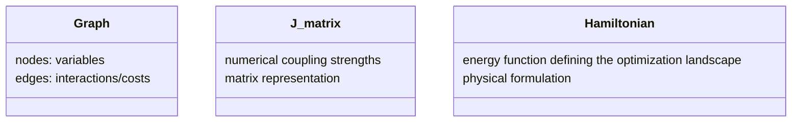
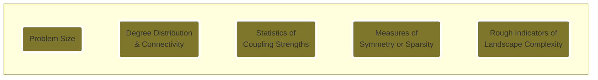
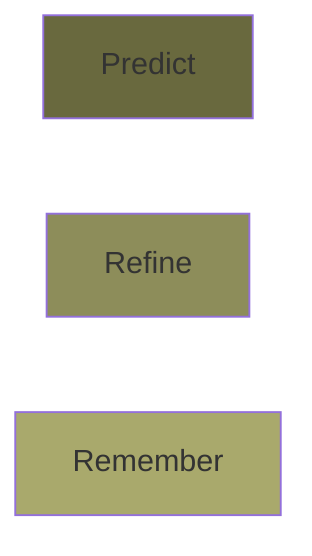

# Notes — Hyperparameter Agent for Probabilistic Solvers
*A minimal, physics-informed architecture*

---
## Structure of the notes 
1. Motivation and Personal Framing 
2. The big picture: understanding the problem
3. What Goes In / What Comes Out
4. From Problem Structure to Experimental Controls
5. Representation: What Does the Agent Actually See?
6. Predict, Refine, Remember 
7. Learning Strategy 

## 1. Motivation and Personal Framing

Before focusing on a specific technical solution, I like to start by understanding the system as a whole: what already exists, what is expensive, where feedback comes from, and where uncertainty actually lives.

This perspective comes from my background in physics. I find it difficult to design components in isolation without first building a mental model of the full pipeline. For me, architecture emerges from understanding interactions, constraints, and failure modes not from assembling modules independently.

In this problem, I treat this as a minimal “hello-world” architecture: a concrete, simple example of how one might approach hyperparameter selection for probabilistic hardware solvers.

My goal is to explore how problem structure, physical intuition, and limited feedback can be combined into a system that proposes reasonable operating regimes, under realistic constraints such as expensive hardware access, imperfect simulators, and noisy outcomes.

I see hyperparameter selection here not as a standard machine learning task, but as a form of experimental control. Small changes in parameters can qualitatively alter solver behavior, meaning we are effectively designing how a physical system explores an energy landscape.

Because of this, I approach this problem as a systems and physics-informed design challenge.

## 2. The big picture: understanding the problem

There is already an existing workflow that translates natural-language problem descriptions into mathematical formulations for combinatorial optimization, expressed as graphs, J-matrices, or Hamiltonians.

At a high level, the pipeline can be viewed as:

My focus is on the hyperparameter agent: the interface between abstract problem structure and concrete experimental controls on the physical solver.

A key observation is that, for probabilistic hardware, the solver is not separable from the input. Hardware topology, embedding constraints, and noise characteristics directly shape how a problem is represented and explored. Performance depends not only on the problem instance, but on how that instance is realized on the device.

Because of this coupling, the solver cannot be treated as a generic black box. Hyperparameters are not merely numerical knobs; they govern how a physical system navigates an energy landscape under constraints and stochasticity.

From this perspective, the role of the agent is to translate structural properties of a problem into reasonable operating regimes for the solver, while continuously adapting based on limited and costly feedback.

This reframing gives you and idea where uncertainty lives in the system:

- in the mapping from abstract problem to hardware realization  
- in the stochastic nature of solver outcomes  
- in simulator–hardware mismatch  
- and in distribution shifts across problem instances

## 3. What Goes In / What Comes Out

At its core, the hyperparameter agent acts as a mapper: it takes a structural description of a problem instance and outputs a proposal of experimental controls for the physical solver.

### Input: Problem Instance

The input to the agent is the problem already expressed in a mathematical form suitable for combinatorial optimization. This can appear in several equivalent representations:

Although these representations look different, they encode the same underlying structure.

From the solver’s perspective, these are not semantic objects. The hardware does not “understand” the meaning of the problem. It responds to the statistical and structural properties of the induced energy landscape.

Physically are quantities such as:

- problem size  
- connectivity patterns  
- coupling strength distributions  
- symmetry and degeneracy  
- roughness of the landscape  

These properties are super important for how the system explores states under noise and constraints.

### Output: Solver Controls

The output of the agent is not a solution to the optimization problem, but a proposal for how the solver should explore it.

This typically could include parameters such as:

- effective temperature or schedules  
- coupling scaling  
- chain strengths  
- number of reads  
- other device-specific controls  

I interpret these hyperparameters as experimental controls: they define the conditions under which a stochastic physical system searches an energy landscape.

Seen this way, hyperparameter selection becomes a problem of choosing operating regimes rather than pinpointing exact optimal values.

The agent’s task is therefore not to predict precise settings, but to identify a region of parameter space where the solver is likely to behave robustly for a given class of problem instances.

## 4. From Problem Structure to Experimental Controls 

Interpreting hyperparameters as experimental controls fundamentally changes how I think about this problem.

Once a combinatorial problem is mapped to a graph, J-matrix, or Hamiltonian, it implicitly defines an energy landscape. The solver’s dynamics, and therefore its performance, depend on how this landscape is sampled.

From a physics perspective, this brings in familiar concepts from statistical mechanics:

- exploration versus exploitation  
- thermal noise  
- metastable states  
- rough versus smooth landscapes  
- freezing and slow dynamics  

Small changes in temperature schedules, coupling scalings, or chain strengths can qualitatively alter the solver’s behavior, pushing it into very different dynamical regimes.

In this framing, hyperparameter selection becomes analogous to choosing experimental conditions in a physical system. We are not simply optimizing numbers; we are designing how a stochastic system navigates a high-dimensional energy surface.

This perspective also highlights why treating the solver as a black box is limiting.

Black-box optimization ignores the fact that problem structure directly shapes the energy landscape, and that solver behavior is strongly influenced by statistical properties such as connectivity, interaction strength distributions, and landscape roughness.

Instead, I assume that there exists some regularity between these structural properties and reasonable operating regimes for the solver.

The goal of the agent is therefore not to find globally optimal hyperparameters for each individual instance, but to infer a suitable dynamical regime conditioned on the structure of the problem.

This is a more modest objective, but also a more realistic one under constraints such as limited hardware access, noisy feedback, and imperfect simulation.

In this sense, the agent acts as a bridge between abstract problem structure and physical experimentation.

## 5. Representation: What Does the Agent Actually See?

A central design question is how the problem instance is presented to the agent.

Although the original input may be a full graph, J-matrix, or Hamiltonian, feeding these raw representations directly into a learning system is often impractical under realistic data constraints. Hardware runs are expensive, simulators are slow, and the number of labeled examples is limited.

This forces a fundamental tradeoff between representational fidelity and sample efficiency.

Rather than exposing the agent to the full problem structure, I propose extracting a small set of features that summarize properties of the induced energy landscape, the quantities that the physical solver actually “feels”.

Examples of such features include:

These features act as a compressed description of the instance, capturing coarse statistical structure while discarding fine-grained relational details.

This compression is not without cost. By summarizing the problem into a low-dimensional representation, the agent loses access to specific structural patterns that may be relevant in certain cases.

However, given very limited training data, this simplification becomes necessary. 

For a minimal architecture, I therefore favor a deliberately simple representation that enables the agent to learn broad correlations between problem structure and solver behavior. The objective at this stage is not precise prediction, but identification of reasonable operating regimes.

## 6. Predict, Refine, Remember 

I frame hyperparameter selection as a sequential decision process operating at multiple time scales and cost. 

Given a problem instance and a limited experimental budget, the agent must answer three different questions:

- What should generally work for this type of problem?
- What is working here and now, under noise and hardware variability?
- What have we learned historically that we should not forget?

These correspond to three complementary layers:

### Predict

The predictive layer provides an initial proposal of solver operating regimes based on the structural features of the problem.

This layer is trained offline using data sources such as simulators and historical runs. Its role is not to produce optimal values, but to suggest a reasonable starting region in hyperparameter space conditioned on problem structure.

In practice, this can be implemented as a supervised regression model mapping problem features to coarse solver controls.

The purpose of this layer is to drastically reduce the effective search space before any expensive hardware interaction.

### Refine 
Once the solver is run on real hardware, stochastic outcomes and simulator–hardware mismatch become apparent.

The refinement layer uses a small number of hardware evaluations to locally adjust the initial proposal.

Rather than performing global black-box optimization, refinement is intentionally lightweight and budgeted. Possible mechanisms include:

- few-step Bayesian optimization  
- bandit-style updates  
- local parameter sweeps  

The goal is to correct biases introduced by simulation and to adapt to device-specific behavior, not to exhaustively search the full parameter space.

### Remember

Over time, the system accumulates experience across many problem instances.

The memory layer stores past experiments and successful operating regimes, along with representations of the associated problem structures.

When a new instance arrives, the agent can retrieve relevant historical cases and reuse previously effective regimes as additional guidance.

This retrieval mechanism improves sample efficiency by avoiding redundant exploration, while remaining advisory rather than authoritative.

Together, these three layers form a closed-loop system:

- Predict provides a physics-informed warm start  
- Refine adapts locally using scarce hardware feedback  
- Remember leverages accumulated experience to accelerate future decisions  

They operate at different costs and time scales, but serve a single purpose: selecting robust operating regimes under uncertainty.

I do not view these components as competing approaches. Instead, they are complementary parts of a single decision-making process designed for environments where data are scarce, feedback is noisy, and experiments are expensive.

## 7. Learning Strategy: Offline + Online

In this case I propose a hybrid learning approach that operates at multiple time scales and data sources.

### Offline Learning: Learning Coarse Structure

The predictive layer is trained offline using data sources:

- simulator-generated runs  
- historical hardware logs  
- synthetic problem distributions  

In this phase, the model learns broad statistical regularities. It builds a prior over hyperparameter space conditioned on problem structure.

This prior reduces the region that needs to be explored on real hardware. Importantly, simulation is treated as a bootstrapping tool rather than as ground truth. Its role is to expose the model to structural trends, not to provide final answers.

### Online Learning: Local Adaptation Under Cost Constraints

Once deployed, the system interacts with real hardware.

Hardware feedback is: stochastic, noisy , limited in quantity and potentially drifting over time.

Online learning focuses on local adaptation rather than global retraining. Given a predicted operating regime, the refinement layer performs a small number of hardware evaluations to adjust parameters locally.

All outcomes are logged, including:

- problem features  
- proposed hyperparameters  
- performance metrics  
- uncertainty estimates  

These logs gradually improve the predictive model and strengthen the retrieval layer.

Model updates occur periodically, not continuously, to avoid instability and overfitting to short-term noise.
