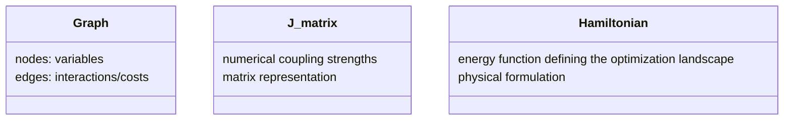

# Notes — Hyperparameter Agent for Probabilistic Solvers
*A minimal, physics-informed architecture*

---
## Structure of the notes 
1. Motivation and Personal Framing 
2. The big picture: understanding the problem
3. What Goes In / What Comes Out
4. From Problem Structure to Experimental Controls
5. Representation: What Does the Agent Actually See?
6. Predict, Refine, Remember 
7. Learning Strategy 

## 1. Motivation and Personal Framing

Before focusing on a specific technical solution, I like to start by understanding the system as a whole: what already exists, what is expensive, where feedback comes from, and where uncertainty actually lives.

This perspective comes from my background in physics. I find it difficult to design components in isolation without first building a mental model of the full pipeline. For me, architecture emerges from understanding interactions, constraints, and failure modes not from assembling modules independently.

In this problem, I treat this as a minimal “hello-world” architecture: a concrete, simple example of how one might approach hyperparameter selection for probabilistic hardware solvers.

My goal is to explore how problem structure, physical intuition, and limited feedback can be combined into a system that proposes reasonable operating regimes, under realistic constraints such as expensive hardware access, imperfect simulators, and noisy outcomes.

I see hyperparameter selection here not as a standard machine learning task, but as a form of experimental control. Small changes in parameters can qualitatively alter solver behavior, meaning we are effectively designing how a physical system explores an energy landscape.

Because of this, I approach this problem as a systems and physics-informed design challenge.

## 2. The big picture: understanding the problem

There is already an existing workflow that translates natural-language problem descriptions into mathematical formulations for combinatorial optimization, expressed as graphs, J-matrices, or Hamiltonians.

At a high level, the pipeline can be viewed as:

My focus is on the hyperparameter agent: the interface between abstract problem structure and concrete experimental controls on the physical solver.

A key observation is that, for probabilistic hardware, the solver is not separable from the input. Hardware topology, embedding constraints, and noise characteristics directly shape how a problem is represented and explored. Performance depends not only on the problem instance, but on how that instance is realized on the device.

Because of this coupling, the solver cannot be treated as a generic black box. Hyperparameters are not merely numerical knobs; they govern how a physical system navigates an energy landscape under constraints and stochasticity.

From this perspective, the role of the agent is to translate structural properties of a problem into reasonable operating regimes for the solver, while continuously adapting based on limited and costly feedback.

This reframing gives you and idea where uncertainty lives in the system:

- in the mapping from abstract problem to hardware realization  
- in the stochastic nature of solver outcomes  
- in simulator–hardware mismatch  
- and in distribution shifts across problem instances

## 3. What Goes In / What Comes Out

At its core, the hyperparameter agent acts as a mapper: it takes a structural description of a problem instance and outputs a proposal of experimental controls for the physical solver.

### Input: Problem Instance

The input to the agent is the problem already expressed in a mathematical form suitable for combinatorial optimization. This can appear in several equivalent representations:

Although these representations look different, they encode the same underlying structure.

From the solver’s perspective, these are not semantic objects. The hardware does not “understand” the meaning of the problem. It responds to the statistical and structural properties of the induced energy landscape.

Physically are quantities such as:

- problem size  
- connectivity patterns  
- coupling strength distributions  
- symmetry and degeneracy  
- roughness of the landscape  

These properties are super important for how the system explores states under noise and constraints.

### Output: Solver Controls

The output of the agent is not a solution to the optimization problem, but a proposal for how the solver should explore it.

This typically could include parameters such as:

- effective temperature or schedules  
- coupling scaling  
- chain strengths  
- number of reads  
- other device-specific controls  

I interpret these hyperparameters as experimental controls: they define the conditions under which a stochastic physical system searches an energy landscape.

Seen this way, hyperparameter selection becomes a problem of choosing operating regimes rather than pinpointing exact optimal values.

The agent’s task is therefore not to predict precise settings, but to identify a region of parameter space where the solver is likely to behave robustly for a given class of problem instances.

